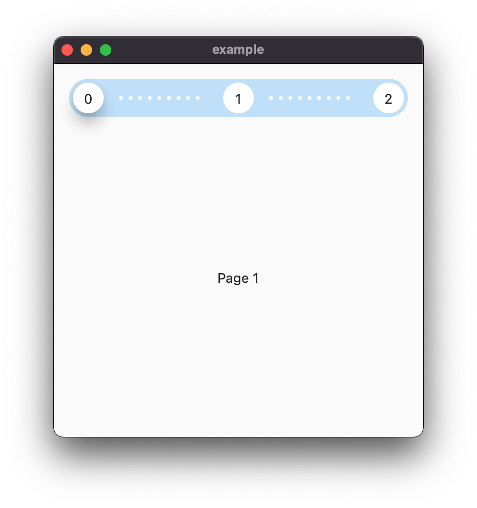
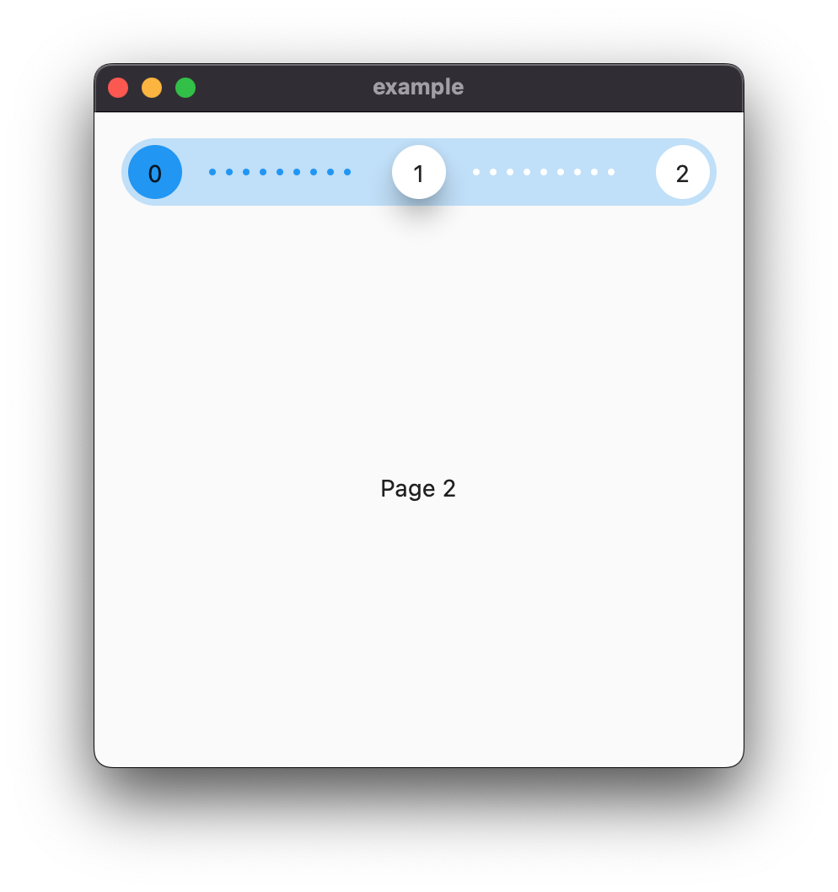

Stepper Page View allows you to create a full page stepper flow that can be heavily customized to your needs.






## Features

A simple widget that allows you to fill any area with your stepper pages. It comes with a default style that matches material design guidelines. It also has simple animations that can be further customized.

## Getting started

Add the following to your `pubspec.yaml`:

```yaml
dependencies:
  stepper_page_view: null
```

And import the package:

```dart
import 'package:stepper_page_view/stepper_page_view.dart';
```

## Usage

```dart
StepperPageView(
  pages: [
    PageStep(
      title: Text('Page 1'),
      content: Text('This is the first page'),
    ),
    PageStep(
      title: Text('Page 2'),
      content: Text('This is the second page'),
    ),
    PageStep(
      title: Text('Page 3'),
      content: Text('This is the third page'),
    ),
  ],
);
```

## Additional information

Feel free to contact me if you have any questions or suggestions.
